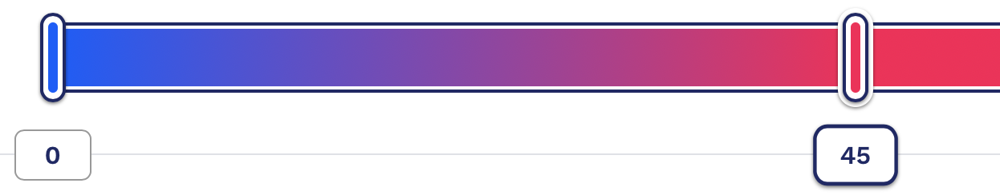

## how to read Shifting

The background colour represents the temperature (Celcius). The Colour is a section from the gradient below

// todo: write rain //

Something that I think is usefull, is to see if it's what the temperature is compared to yesterday.
Depending on the position of the blob, you can see if it is colder or warmer.

Colder:

About the same:

Warmer:

##### [Powered by Darksky](https://www.google.com)
